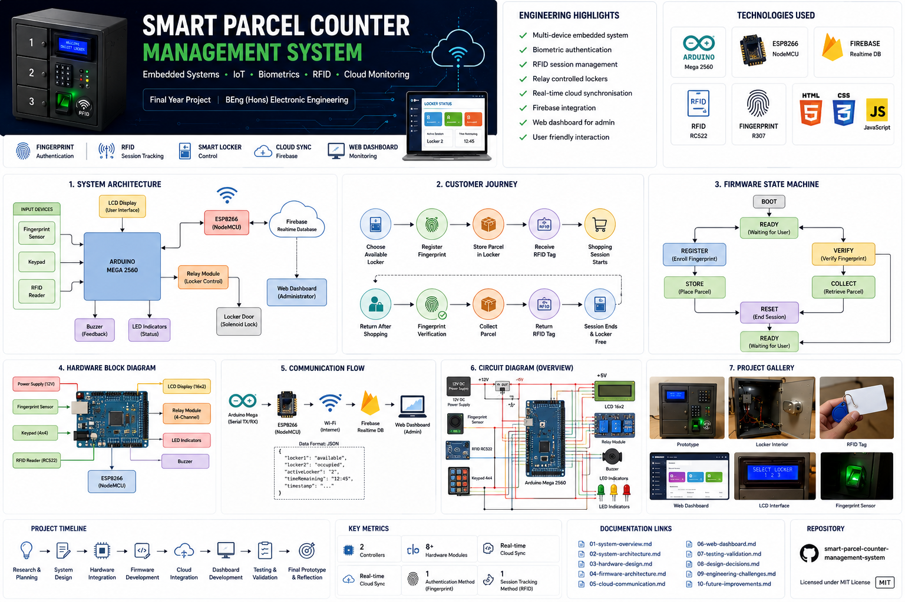
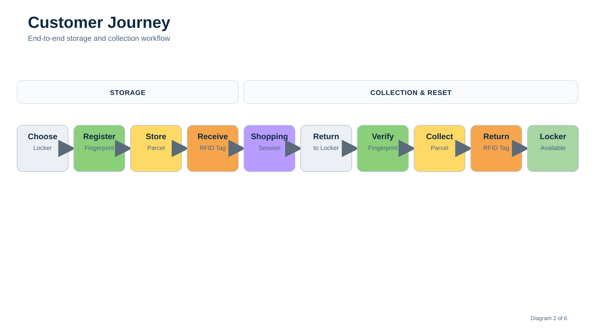
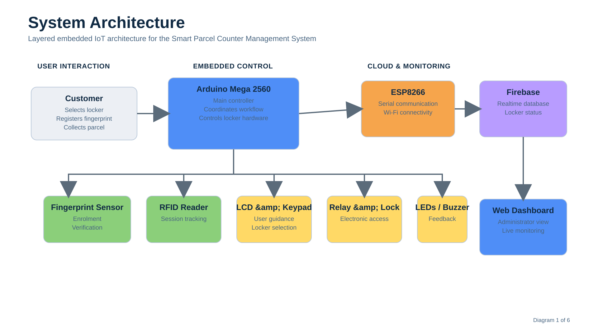
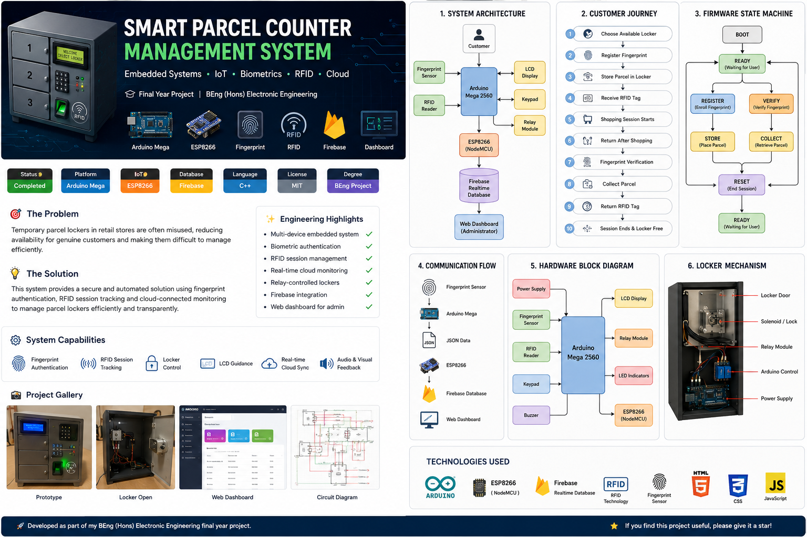
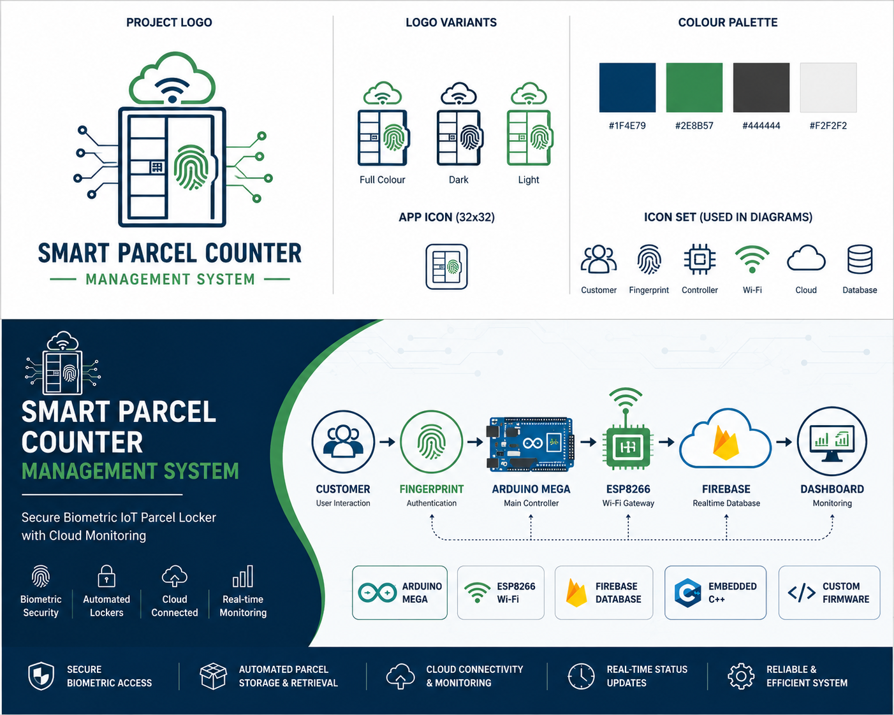

# Smart Parcel Counter Management System



Secure biometric IoT parcel locker developed as my BEng (Hons) Electronic Engineering final-year project.

> **A cloud-connected embedded system that automates temporary parcel storage using fingerprint authentication, RFID session tracking and real-time locker monitoring.**


---

## Project at a Glance

| | |
|:---|:---|
| **Project** | Smart Parcel Counter Management System |
| **Project Type** | Final-year engineering project |
| **Degree** | BEng (Hons) Electronic Engineering |
| **Outcome** | Distinction |
| **Primary Controller** | Arduino Mega 2560 |
| **Communication** | ESP8266 (NodeMCU) |
| **Cloud Platform** | Firebase Realtime Database |
| **Primary Language** | Embedded C++ |
| **Authentication** | Fingerprint biometrics |
| **Session Tracking** | RFID |
| **Application** | Retail parcel management |

---

## The Problem

For my final-year project, I wanted to solve a practical engineering problem rather than simply demonstrate a collection of technologies.

While visiting supermarkets and retail stores, I noticed that temporary parcel lockers could be misused, reducing their availability for genuine customers and making them difficult to manage efficiently.

This project explores how embedded systems can automate parcel storage through biometric authentication, RFID-based session management and cloud-connected monitoring, creating a more secure and transparent workflow for customers and administrators.

---

## The Solution

The Smart Parcel Counter Management System is an embedded IoT prototype designed to automate parcel storage and collection.

An Arduino Mega coordinates the user interface, authentication devices and locker hardware. An ESP8266 provides Wi-Fi connectivity and communicates with Firebase Realtime Database, separating real-time hardware control from cloud communication.

The repository is a portfolio refresh of the original university prototype. It preserves the engineering design, firmware and technical documentation while presenting them in a clearer, more maintainable structure.

---

## System Capabilities

- Fingerprint-based parcel collection
- RFID shopping-session tracking
- Electronic locker control
- LCD-guided customer interaction
- Firebase synchronisation through an ESP8266
- Audible and visual user feedback
- Multi-controller embedded-system integration
- Documented hardware, firmware and cloud architecture

---

## Customer Journey



1. The customer selects an available locker.
2. A fingerprint is enrolled.
3. The parcel is placed inside the locker.
4. An RFID tag represents the active shopping session.
5. The storage period is monitored.
6. The customer returns.
7. The fingerprint is verified.
8. The locker unlocks.
9. The RFID tag is returned.
10. The locker becomes available again.

---

## System Architecture



The system is organised into three main layers:

- **Embedded control:** Arduino Mega and connected peripherals
- **Wireless communication:** ESP8266 and Firebase
- **Monitoring:** cloud data intended for an administrative interface

The Arduino manages time-sensitive hardware interaction, while the ESP8266 handles wireless communication. This separation reduces networking complexity in the main controller firmware.

Read the detailed [system architecture documentation](docs/02-system-architecture.md).

---

## Hardware Overview

| Component | Purpose |
|---|---|
| Arduino Mega 2560 | Main system controller |
| ESP8266 | Wi-Fi and Firebase communication |
| Fingerprint sensor | Customer authentication |
| RFID reader | Shopping-session tracking |
| LCD display | User guidance |
| Keypad | User input and locker selection |
| Relay modules | Electronic lock control |
| LEDs | Visual status indication |
| Buzzer | Audible feedback |

See the [hardware design](docs/03-hardware-design.md), [pinout](hardware/pinout.md) and [bill of materials](hardware/bom/bill-of-materials.md).

---

## Firmware Overview

The firmware coordinates customer interaction, hardware peripherals, locker states and cloud communication.

The repository contains separate source areas for:

- [Arduino Mega firmware](firmware/arduino/)
- [ESP8266 firmware](firmware/esp8266/)

Detailed design information is available in the [firmware architecture document](docs/04-firmware-architecture.md).

---

## Cloud and Monitoring

The ESP8266 firmware provides the communication layer between the Arduino Mega and Firebase Realtime Database.

The current portfolio repository documents the intended monitoring workflow, but it does not yet include a production-ready web dashboard.

See [cloud and dashboard documentation](docs/05-cloud-and-dashboard.md).

---

## Repository Structure

```text
Parcel-Counter-Management-System/
├── README.md
├── LICENSE
├── CHANGELOG.md
├── .gitignore
├── docs/
│   ├── 01-system-overview.md
│   ├── 02-system-architecture.md
│   ├── 03-hardware-design.md
│   ├── 04-firmware-architecture.md
│   ├── 05-cloud-and-dashboard.md
│   ├── 06-testing-and-validation.md
│   ├── 07-design-decisions.md
│   ├── 08-challenges-and-limitations.md
│   ├── 09-future-improvements.md
│   └── 10-lessons-learned.md
├── firmware/
│   ├── arduino/
│   └── esp8266/
├── hardware/
│   ├── bom/
│   ├── datasheets/
│   ├── schematics/
│   └── pinout.md
├── images/
│   ├── branding/
│   ├── diagrams/
│   ├── prototype/
│   └── screenshots/
└── web/
```

---

## Documentation

1. [System overview](docs/01-system-overview.md)
2. [System architecture](docs/02-system-architecture.md)
3. [Hardware design](docs/03-hardware-design.md)
4. [Firmware architecture](docs/04-firmware-architecture.md)
5. [Cloud and dashboard](docs/05-cloud-and-dashboard.md)
6. [Testing and validation](docs/06-testing-and-validation.md)
7. [Design decisions](docs/07-design-decisions.md)
8. [Challenges and limitations](docs/08-challenges-and-limitations.md)
9. [Future improvements](docs/09-future-improvements.md)
10. [Lessons learned](docs/10-lessons-learned.md)
11. [Firmware audit notes](docs/11-firmware-audit-notes.md)
12. [Internal link audit](docs/12-internal-link-audit.md)

---

## Getting Started

Clone the repository:

```bash
git clone https://github.com/briannanah-ux/Parcel-Counter-Management-System.git
```

Open the Arduino sketch in the Arduino IDE and install the libraries listed in [`firmware/arduino/libraries.md`](firmware/arduino/libraries.md).

Configure the ESP8266 using the guidance in [`firmware/esp8266/README.md`](firmware/esp8266/README.md). Do not commit real Wi-Fi credentials or Firebase secrets.

---

## Lessons Learned

This project strengthened my understanding of embedded systems by requiring electronics, firmware and cloud technologies to operate as one solution.

It also highlighted the importance of modular software design, clear hardware interfaces, secure configuration management and documenting engineering decisions throughout development.

---

## Future Improvements

Further development could include:

- designing a custom PCB;
- replacing blocking delays with non-blocking scheduling;
- formalising the firmware as a finite-state machine;
- improving authentication and encrypted communication;
- adding more detailed diagnostics and fault logging;
- developing a production-ready monitoring dashboard;
- expanding the prototype to support more lockers.

See the full [future improvements document](docs/09-future-improvements.md).

---

## Author

**Brian Nana**  
BEng (Hons) Electronic Engineering  
MSc Renewable Energy Systems Technology

This repository forms part of my engineering portfolio and demonstrates embedded-system development, IoT integration and technical documentation.

---

## Licence

This project is released under the [MIT Licence](LICENSE).


## Gallery

### Project Overview



### Branding

The project branding, colour palette and icon set are shown below.


