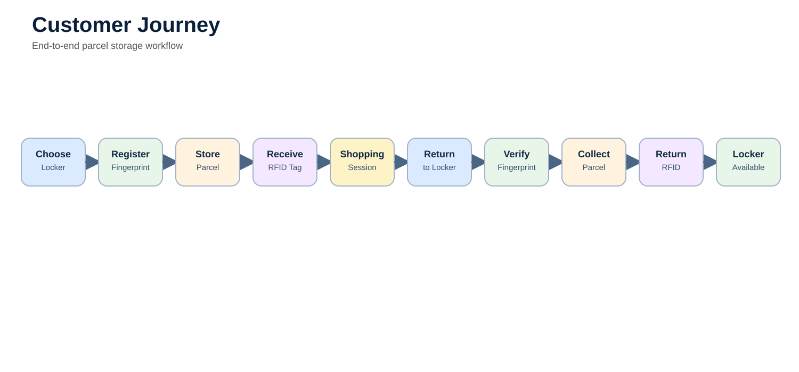
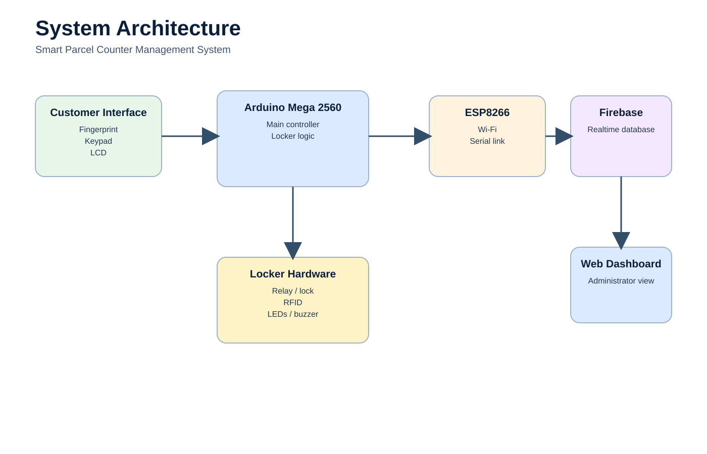

# Smart Parcel Counter Management System

> **A cloud-connected embedded system that automates temporary parcel storage using fingerprint authentication, RFID session tracking and real-time locker monitoring.**


---

# Project at a Glance

| | |
|:---|:---|
| **Project** | Smart Parcel Counter Management System |
| **Project Type** | Final Year Project |
| **Degree** | BEng (Hons) Electronic Engineering |
| **Outcome** | Distinction |
| **Primary Controller** | Arduino Mega 2560 |
| **Communication** | ESP8266 (NodeMCU) |
| **Cloud Platform** | Firebase Realtime Database |
| **Languages** | C++, HTML, CSS, JavaScript |
| **Authentication** | Fingerprint Biometrics |
| **Session Tracking** | RFID |
| **Application** | Retail Parcel Management |

---

# The Problem

For my final-year project, I wanted to solve a practical engineering problem rather than simply demonstrate a collection of technologies.

While visiting supermarkets and retail stores, I noticed that temporary parcel lockers could be misused, reducing their availability for genuine customers and making them difficult to manage efficiently.

This project explores how embedded systems can automate parcel storage through biometric authentication, RFID-based session management and cloud-connected monitoring, creating a more secure and transparent workflow for both customers and administrators.

---

# The Solution

The Smart Parcel Counter Management System is an embedded IoT prototype that automates the complete parcel storage process.

Customers register their fingerprint when storing a parcel, receive an RFID tag representing their active shopping session, and later retrieve their parcel using biometric verification.

An Arduino Mega coordinates all hardware components while an ESP8266 synchronises locker information with Firebase, allowing administrators to monitor the system through a web dashboard.

---

# System Capabilities

- Secure fingerprint-based parcel collection
- RFID shopping session management
- Electronic locker control
- LCD-guided customer interaction
- Real-time Firebase synchronisation
- Cloud-based locker monitoring
- Audible and visual user feedback
- Multi-device embedded system integration

---

# Customer Journey



1. Customer selects an available locker.
2. Fingerprint is enrolled.
3. Parcel is placed inside the locker.
4. RFID tag is issued.
5. Shopping session is monitored.
6. Customer returns.
7. Fingerprint is verified.
8. Locker unlocks.
9. RFID tag is returned.
10. Locker becomes available again.

---

# System Architecture



The system consists of three layers:

- Embedded control (Arduino Mega)
- Wireless communication (ESP8266 + Firebase)
- Web monitoring dashboard

The Arduino manages all real-time hardware interaction while the ESP8266 handles wireless communication with Firebase, keeping hardware control and networking responsibilities separate.

---

# Hardware Overview

The prototype integrates multiple embedded devices into a single system.

| Component | Purpose |
|-----------|---------|
| Arduino Mega 2560 | Main system controller |
| ESP8266 | Wi-Fi communication |
| Fingerprint Sensor | Customer authentication |
| RFID Reader | Shopping session tracking |
| LCD Display | User guidance |
| Keypad | Locker selection |
| Relay Module | Locker control |
| LEDs | Session indication |
| Buzzer | Audible feedback |

More information is available in [docs/hardware.md](docs/hardware.md).

---

# Firmware Overview

The firmware continuously coordinates customer interaction, hardware peripherals and cloud communication.

Major responsibilities include:

- System initialisation
- Fingerprint enrolment
- Fingerprint verification
- Locker control
- RFID management
- LCD updates
- Timer management
- Firebase communication

The firmware naturally follows a state-based workflow from customer registration through to parcel collection.

See [docs/firmware.md](docs/firmware.md).

---

# Cloud Monitoring

The ESP8266 communicates with Firebase to synchronise locker information in real time.

Typical information includes:

- Locker availability
- Active locker number
- Session status
- Timer state
- Authentication status

A web dashboard presents this information to administrators, providing a live overview of the system.

See [web/README.md](web/README.md).

---

# Project Gallery

| Prototype | Dashboard |
|-----------|-----------|
| *(Add prototype photo)* | *(Add dashboard screenshot)* |

| Circuit Diagram | Hardware |
|----------------|----------|
| *(Add circuit image)* | *(Add hardware photo)* |

---

# Repository Structure

```text
smart-parcel-counter-management-system/
│
├── README.md
├── LICENSE
│
├── docs/
│   ├── architecture.md
│   ├── hardware.md
│   ├── firmware.md
│   ├── communication.md
│   ├── testing.md
│   ├── challenges.md
│   └── future-improvements.md
│
├── firmware/
│   ├── arduino/
│   ├── esp8266/
│   └── README.md
│
├── hardware/
│   ├── circuit-diagrams/
│   ├── components/
│   └── README.md
│
├── web/
│   └── README.md
│
├── images/
│   ├── diagrams/
│   ├── hardware/
│   ├── screenshots/
│   └── hero/
│
└── assets/
```

---

# Documentation

Additional documentation is available in the `docs` directory.

- Architecture
- Hardware Design
- Firmware Design
- Communication Flow
- Engineering Decisions
- Testing
- Challenges
- Future Improvements

---

# Lessons Learned

This project strengthened my understanding of embedded systems by requiring the integration of electronics, firmware and cloud technologies into a single solution.

Looking back, it also highlighted the importance of modular software design, clear hardware interfaces and documenting engineering decisions throughout the development process.

---

# Future Improvements

If I were to continue developing this project today, I would:

- Design a custom PCB.
- Refactor the firmware into modular source files.
- Replace blocking delays with non-blocking scheduling.
- Formalise the firmware as a finite state machine.
- Add encrypted communication.
- Develop a mobile application.
- Improve diagnostics and fault logging.

---

# Getting Started

Clone the repository:

```bash
git clone https://github.com/<username>/smart-parcel-counter-management-system.git
```

Open the Arduino firmware in the Arduino IDE and upload it to the Arduino Mega.

Configure the ESP8266 with your Wi-Fi credentials and Firebase project details before deployment.

---

# License

This project is released under the MIT License.
