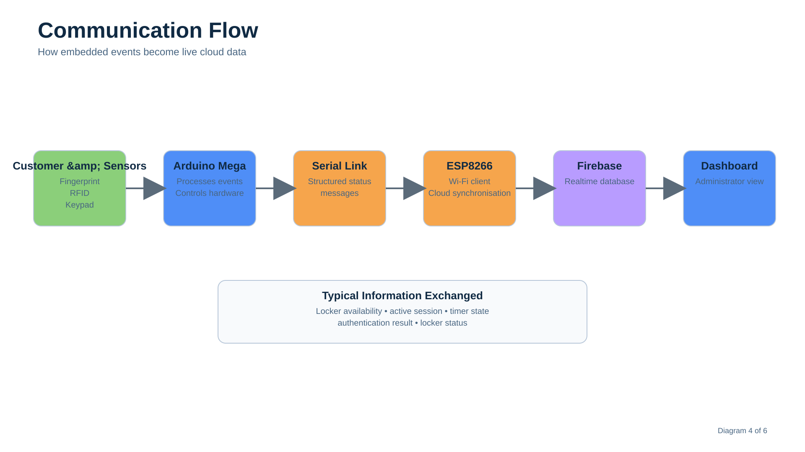

# System Architecture

## Overview

The Smart Parcel Counter Management System was designed as an embedded Internet of Things system that combines customer authentication, locker control, session tracking and cloud-based monitoring.

The system is organised into four main layers:

1. User interaction
2. Embedded control
3. Communication and cloud services
4. Web-based monitoring

Each layer has a clear responsibility. This separation makes the system easier to understand, test and extend.


---

## Architecture Layers

### 1. User Interaction Layer

The user interaction layer provides the physical interface between the customer and the parcel counter.

It includes:

* Fingerprint sensor
* RFID reader
* Keypad
* LCD display
* LED indicators
* Buzzer

The customer uses the keypad and LCD to navigate the locker process.

The fingerprint sensor is used for customer authentication during parcel storage and collection.

The RFID tag is used to track an active locker session. It is not used as the primary authentication method.

The LEDs and buzzer provide visual and audible feedback during system operation.

---

### 2. Embedded Control Layer

The Arduino Mega 2560 acts as the main embedded controller.

It is responsible for:

* Reading input from the fingerprint sensor
* Reading RFID tags
* Processing keypad selections
* Updating the LCD display
* Controlling the locker relay
* Managing LEDs and the buzzer
* Coordinating parcel storage and collection
* Sending system information to the ESP8266

The Arduino Mega was suitable for the project because the system required several peripherals and input/output connections.

The controller manages the main system workflow and determines when the locker should be opened, locked or made available.

---

### 3. Communication Layer

The ESP8266 provides Wi-Fi communication between the embedded system and Firebase.

The Arduino Mega sends system information to the ESP8266 through a serial connection.

This information may include:

* Locker availability
* Session status
* Authentication status
* Timer information
* Locker state

The ESP8266 receives the information, connects to the wireless network and updates the cloud database.

This approach separates the main locker control logic from the internet communication process.

---

### 4. Cloud and Monitoring Layer

Firebase acts as the cloud database for the system.

It stores information received from the ESP8266 and makes the information available to the web dashboard.

The dashboard allows an administrator to monitor the state of the parcel counter remotely.

The cloud layer supports:

* Realtime locker-status updates
* Active-session monitoring
* Availability monitoring
* Remote access to system information

The dashboard is intended for monitoring rather than directly controlling the locker hardware.

---

## System Components

The main system components are shown below.

| Component          | Responsibility                            |
| ------------------ | ----------------------------------------- |
| Arduino Mega 2560  | Main system controller                    |
| Fingerprint sensor | Customer enrolment and verification       |
| RFID reader        | Active-session tracking                   |
| Keypad             | Locker selection and user input           |
| LCD display        | Customer instructions and system feedback |
| Relay module       | Electronic locker control                 |
| LEDs               | Visual status indication                  |
| Buzzer             | Audible user feedback                     |
| ESP8266            | Wi-Fi and Firebase communication          |
| Firebase           | Realtime system-state storage             |
| Web dashboard      | Administrator monitoring interface        |

---

## Customer Workflow

The architecture supports two main operations:

* Parcel storage
* Parcel collection


### Parcel Storage

During the storage process:

1. The customer selects an available locker.
2. The system registers the customer's fingerprint.
3. The selected locker is opened.
4. The customer places the parcel inside.
5. The locker is secured.
6. The customer receives an RFID tag.
7. The RFID tag is associated with the active session.
8. The system updates the locker status.

---

### Parcel Collection

During the collection process:

1. The customer returns to the parcel counter.
2. The system verifies the customer's fingerprint.
3. The correct locker is identified.
4. The locker is opened.
5. The customer retrieves the parcel.
6. The customer returns the RFID tag.
7. The active session ends.
8. The locker becomes available again.

Fingerprint verification protects the parcel from unauthorised collection.

The RFID tag supports session management but does not replace biometric authentication.

---

## Data Flow

System information moves through the architecture in the following sequence:

```text
Customer and sensors
        ↓
Arduino Mega 2560
        ↓
Serial communication
        ↓
ESP8266
        ↓
Wi-Fi network
        ↓
Firebase
        ↓
Web dashboard
```



The Arduino Mega remains responsible for local system operation.

This means the embedded workflow can be separated from the cloud-monitoring functionality.

The ESP8266 acts as the communication bridge between the embedded controller and Firebase.

---

## Hardware Interaction

The Arduino Mega connects to the system peripherals and coordinates their operation.


Input devices provide information to the controller:

* Fingerprint sensor
* RFID reader
* Keypad

Output devices provide feedback or physical control:

* LCD display
* Relay module
* LEDs
* Buzzer

The ESP8266 provides communication with the cloud platform.

---

## Architectural Design Principles

### Separation of Responsibilities

The system separates locker control from internet communication.

The Arduino Mega manages the physical system, while the ESP8266 manages wireless communication.

This reduces the complexity of the main controller firmware.

---

### Modular Design

Each hardware component performs a specific task.

This modular structure supports easier troubleshooting and future replacement of individual components.

---

### Local Control

Critical actions such as fingerprint verification and locker operation are handled by the embedded controller.

The system does not depend on the dashboard to complete the customer workflow.

---

### Realtime Monitoring

Firebase provides a mechanism for synchronising the locker state with the web dashboard.

This allows administrators to view current information without directly interacting with the embedded hardware.

---

### User-Centred Operation

The system guides the customer through the process using the LCD, keypad, LEDs and buzzer.

The workflow was designed to minimise the number of actions required from the user.

---

## Design Constraints

The prototype was developed within the limitations of an undergraduate engineering project.

Important constraints included:

* Available hardware
* Limited development time
* Prototype-scale locker construction
* Serial communication between controllers
* Reliance on available Wi-Fi connectivity
* Basic dashboard functionality

The architecture was therefore designed to demonstrate full system integration rather than production-scale deployment.

---

## Summary

The Smart Parcel Counter Management System combines embedded control, biometric authentication, RFID session tracking, cloud communication and web-based monitoring.

The Arduino Mega controls the physical workflow.

The ESP8266 provides internet connectivity.

Firebase stores system information.

The dashboard presents the information to an administrator.

This layered architecture allowed multiple hardware and software technologies to operate as one integrated parcel-management system.
