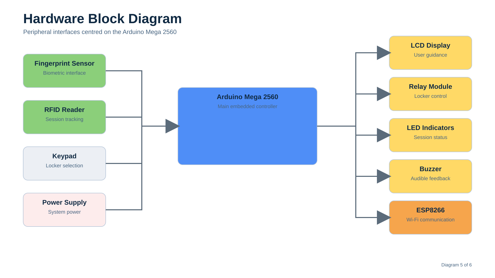

# Hardware Design

## Overview

The Smart Parcel Counter Management System integrates several hardware components to automate parcel storage and collection. Each component was selected to perform a specific function within the overall workflow, from authenticating customers to controlling locker access and updating the cloud database.

The design follows a modular approach, allowing each device to communicate with the Arduino Mega while performing an independent task. This simplified development and made it easier to test each subsystem before integrating the complete prototype.

---

## System Hardware

The prototype consists of the following hardware components:

| Component          | Purpose                                   |
| ------------------ | ----------------------------------------- |
| Arduino Mega 2560  | Main system controller                    |
| ESP8266            | Wi-Fi communication with Firebase         |
| Fingerprint Sensor | Customer enrolment and authentication     |
| RFID Reader        | Session tracking                          |
| Keypad             | Locker selection and user input           |
| LCD Display        | Customer instructions and system feedback |
| Relay Module       | Electronic locker control                 |
| LEDs               | Visual status indication                  |
| Buzzer             | Audible feedback                          |
| Power Supply       | Powers the embedded system                |

---

## Arduino Mega 2560

The Arduino Mega 2560 serves as the central controller for the entire system.

It receives input from the fingerprint sensor, RFID reader and keypad, processes the customer workflow and controls all output devices, including the LCD, relay module, LEDs and buzzer.

The Mega was selected because the project required a large number of input and output connections. Compared to smaller Arduino boards, it provides sufficient digital and serial interfaces to support multiple peripherals operating at the same time.

Using a single controller for the locker logic also simplified software development by keeping the workflow in one location.

---

## ESP8266 Wi-Fi Module

The ESP8266 provides wireless communication between the embedded system and Firebase.

Rather than connecting every hardware component directly to the internet, the Arduino Mega sends system information to the ESP8266 through serial communication. The ESP8266 then updates the Firebase database whenever the locker status changes.

Separating the communication module from the main controller keeps the locker management logic independent from the cloud services. This makes the embedded software easier to understand and maintain.

---

## Fingerprint Sensor

The fingerprint sensor is the primary method of customer authentication.

When storing a parcel, the customer enrols their fingerprint, which is associated with the selected locker. During parcel collection, the customer must present the same fingerprint before access is granted.

Using biometric authentication removes the need for customers to remember passwords or carry access codes, while also reducing the risk of unauthorised parcel collection.

Within this project, fingerprint verification provides the primary security mechanism.

---

## RFID Reader

The RFID reader manages the active locker session.

After a parcel has been stored, the customer receives an RFID tag linked to that session. The tag is returned when the parcel is collected, allowing the session to be closed and the locker to become available again.

Unlike the fingerprint sensor, the RFID tag is **not** used to authenticate the customer. Its purpose is to identify and manage active locker sessions throughout the storage process.

This combination of biometric authentication and RFID session tracking provides clear separation between security and operational management.

---

## Keypad

The keypad provides a simple method for interacting with the system.

Customers use it to select a locker and navigate the storage process. The keypad offers a low-cost and reliable input method that integrates easily with the Arduino Mega.

---

## LCD Display

The LCD display guides customers through each stage of the workflow.

Instructions displayed on the screen include locker selection, fingerprint enrolment and parcel collection. Providing clear feedback reduces user confusion and makes the system easier to operate without assistance.

---

## Relay Module

The relay module controls the electronic locking mechanism.

When authentication is successful, the Arduino activates the relay, allowing the selected locker to be opened. Once the parcel has been stored or collected, the relay is deactivated and the locker is secured.

Using a relay isolates the low-voltage control circuit from the locker hardware while allowing the Arduino to control higher-power devices safely.

---

## LEDs

LED indicators provide immediate visual feedback to the customer.

Different LED states can be used to indicate whether the system is ready, processing a request or has successfully completed an operation.

Visual feedback allows users to understand the system status without relying entirely on the LCD display.

---

## Buzzer

The buzzer provides audible confirmation during system operation.

Audio feedback complements the LED indicators and LCD messages by confirming successful actions or drawing attention to errors and invalid operations.

Using both visual and audible indicators improves the overall user experience.

---

## Power Supply

The prototype is powered by a regulated power supply suitable for the connected hardware components.

Maintaining a stable supply voltage is important for reliable communication between the Arduino Mega, ESP8266 and peripheral devices.

---

## Hardware Integration

Although each hardware component performs a separate function, they operate together as a single embedded system.

The Arduino Mega coordinates communication between the input devices, output devices and Wi-Fi module, ensuring that each stage of the customer workflow is completed in the correct sequence.

This modular architecture made it possible to develop and test individual components before integrating the complete prototype.

---

## Design Decisions

Several design decisions influenced the hardware architecture:

* The Arduino Mega was selected because it provided sufficient I/O connections for all peripherals.
* The ESP8266 was dedicated to wireless communication, allowing the Arduino to focus on locker control.
* Fingerprint authentication was chosen to improve security during parcel collection.
* RFID technology was used for session management rather than customer authentication.
* Separate visual and audible indicators were included to improve usability.

These decisions helped balance functionality, simplicity and the practical constraints of an undergraduate engineering project.

---

## Summary

The hardware design combines biometric authentication, RFID session tracking, electronic locker control and cloud connectivity into a single embedded platform.

By assigning each component a clearly defined role, the system remains modular, easier to test and straightforward to extend in future iterations.
