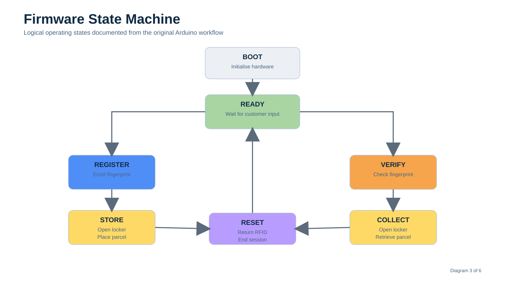
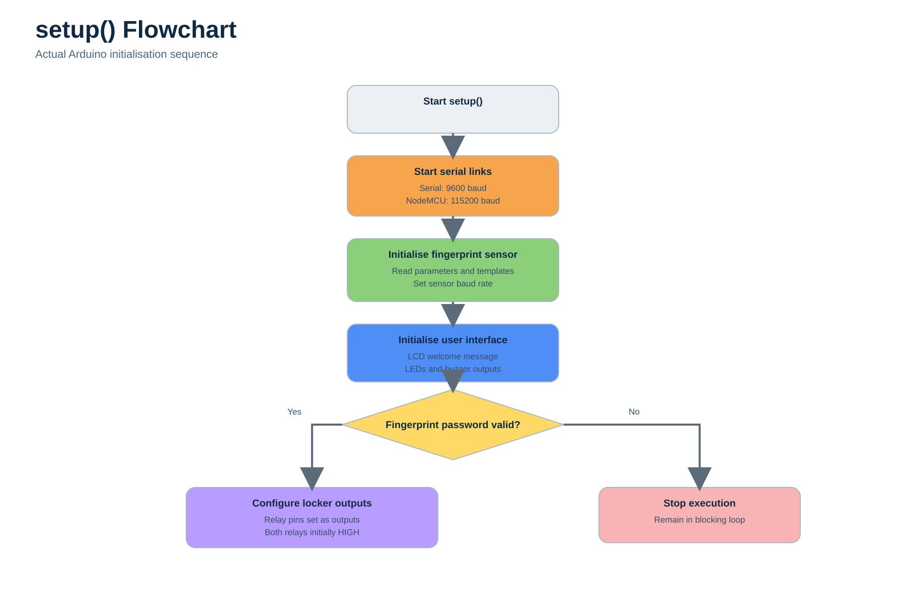
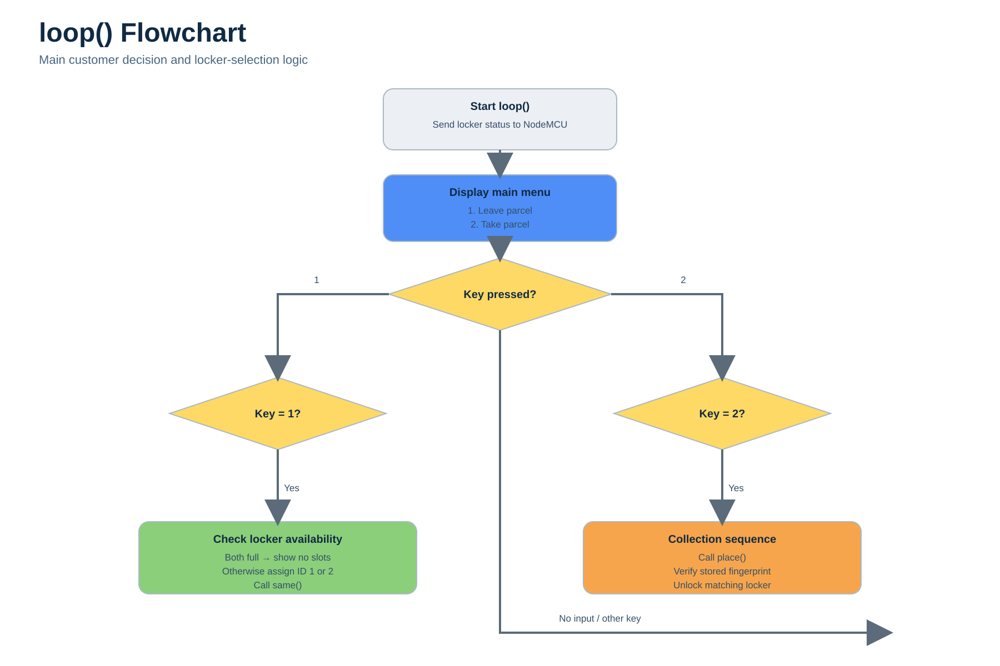
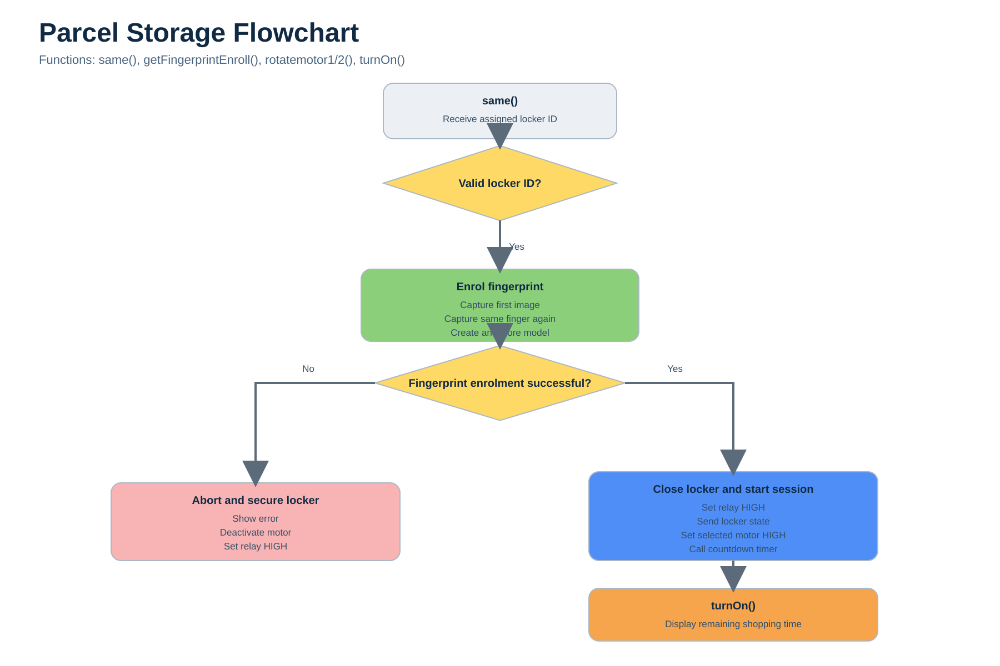
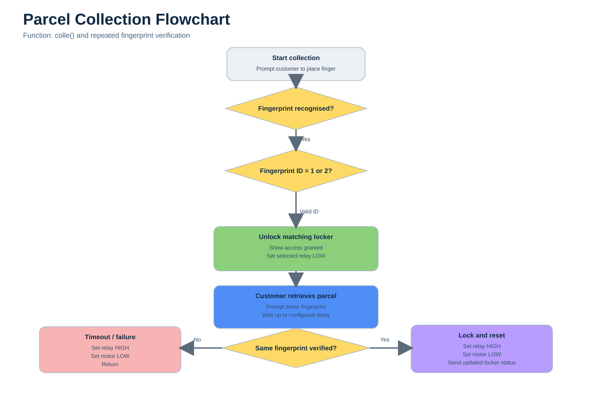

# Firmware Architecture

## Overview

The firmware controls the complete operation of the Smart Parcel Counter Management System. It coordinates customer interaction, biometric authentication, locker control, RFID session management and communication with the ESP8266.

The firmware is written for the Arduino Mega 2560 and is organised around a continuous execution loop. Rather than using a real-time operating system, the system follows the standard Arduino programming model, making the implementation easier to understand while meeting the requirements of the project.



---

## Firmware Structure

The firmware is divided into three main sections:

* System initialisation
* Continuous system operation
* Supporting functions

This structure separates configuration tasks from the operational workflow.

---

## System Initialisation

The firmware begins execution inside the `setup()` function.

During initialisation, the Arduino configures the hardware required for system operation, including the LCD display, keypad, fingerprint sensor, RFID reader, serial communication and output devices.

Once initialisation is complete, the controller enters its normal operating state.

---

## Continuous Operation

After initialisation, program execution moves to the `loop()` function.

This function runs continuously while the system is powered.

Within each cycle, the firmware waits for customer interaction and determines which operation should be performed.

Depending on the customer's input, the firmware transitions between parcel storage, parcel collection and system monitoring tasks.

The continuous execution model ensures that the controller is always ready to respond to user input.

---

## Parcel Storage

The parcel storage workflow begins when a customer selects an available locker.

The firmware calls the functions responsible for enrolling a fingerprint, opening the locker and recording the active session.

The process includes:

* Locker selection
* Fingerprint enrolment
* Locker access
* Parcel placement
* Session creation
* RFID tag allocation
* Locker status update

Once the parcel has been stored, the firmware updates the system status before returning to the waiting state.

---

## Parcel Collection

When the customer returns, the firmware follows the collection workflow.

The stored fingerprint is verified before access is granted to the locker.

The collection process consists of:

* Fingerprint verification
* Locker identification
* Locker release
* Parcel retrieval
* RFID return
* Session termination
* Locker availability update

Only a successful fingerprint verification allows the collection process to continue.

---

## Function Overview

The firmware is organised into a number of dedicated functions that each perform a specific task.

| Function                 | Purpose                                           |
| ------------------------ | ------------------------------------------------- |
| `setup()`                | Initialises hardware and configures the system    |
| `loop()`                 | Runs the main operating cycle                     |
| `getFingerprintEnroll()` | Registers a customer's fingerprint                |
| `getFingerPrint()`       | Verifies a stored fingerprint                     |
| `place()`                | Manages parcel storage                            |
| `colle()`                | Manages parcel collection                         |
| `same()`                 | Handles workflow decisions within the application |
| `check_door()`           | Monitors the locker door state                    |
| `send_data()`            | Sends system information to the ESP8266           |
| `rotatemotor1()`         | Controls the locker mechanism                     |
| `rotatemotor2()`         | Controls the locker mechanism                     |
| `turnOn()`               | Activates system outputs when required            |

Each function has a clearly defined responsibility, making the firmware easier to maintain and troubleshoot.

---

## Communication with the ESP8266

The Arduino Mega does not communicate directly with Firebase.

Instead, the firmware passes relevant system information to the ESP8266 through serial communication.

The ESP8266 is responsible for forwarding this information to the cloud database.

This separation allows the Arduino firmware to remain focused on locker operation while the ESP8266 manages internet connectivity.

---

## Error Handling

The firmware provides feedback throughout the customer workflow using the LCD display, LEDs and buzzer.

These indicators notify the customer when:

* Authentication succeeds
* Authentication fails
* A locker becomes available
* A process has completed
* User input is required

Providing immediate feedback improves usability and reduces the likelihood of incorrect operation.

---

## Firmware Design Decisions

Several design decisions influenced the firmware implementation:

* The standard Arduino programming model was used to keep the control logic straightforward.
* Individual functions were created for major operations to improve readability.
* Authentication was separated from session tracking, with fingerprints used for verification and RFID used for session management.
* Communication with Firebase was delegated to the ESP8266 to reduce the complexity of the main controller.

These decisions helped produce firmware that is modular, understandable and suitable for the requirements of the prototype.

---

## Firmware Workflow

The overall firmware execution follows the sequence shown below.

```text
System Initialisation
        │
        ▼
Wait for User Input
        │
        ▼
Select Operation
   ┌───────────────┐
   │               │
   ▼               ▼
Store Parcel   Collect Parcel
   │               │
   └──────┬────────┘
          ▼
Update System Status
          ▼
Send Data to ESP8266
          ▼
Return to Waiting State
```

This workflow repeats continuously while the system remains powered.

---

## Summary

The firmware coordinates every stage of the parcel management process, from customer authentication to locker control and cloud communication.

By dividing the implementation into dedicated functions and separating embedded control from wireless communication, the software remains organised and easier to maintain while supporting the complete operation of the Smart Parcel Counter Management System.

## Function-Level Flowcharts

The diagrams below were created from the original Arduino source code. They show how the main firmware functions interact during system initialisation, parcel storage and parcel collection.

### System Initialisation

The `setup()` function configures the serial interfaces, fingerprint sensor, LCD, indicators and locker relays before normal operation begins.



### Main Execution Loop

The `loop()` function sends the current locker status to the NodeMCU and displays the two main customer options:

* Leave a parcel
* Take a parcel

The selected operation determines whether the firmware checks for an available locker or begins fingerprint verification for parcel collection.



### Parcel Storage

The storage sequence begins after the firmware identifies an available locker and assigns its fingerprint ID.

The customer presents the same finger twice during enrolment. If the images match, the fingerprint model is stored using the selected locker ID. The locker is then secured, its status is sent to the NodeMCU and the shopping timer begins.



### Parcel Collection

During collection, the firmware searches for a stored fingerprint and uses the returned fingerprint ID to identify the correct locker.

The matching locker is unlocked so that the customer can retrieve the parcel. The customer then presents the same finger again before the locker is secured and its updated status is sent to the NodeMCU.



The locker-specific code is repeated for locker 1 and locker 2 in the original implementation. The flowcharts combine these repeated branches into a single “matching locker” path while preserving the behaviour of the firmware.

